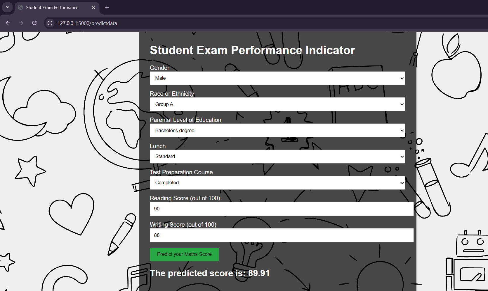

# 🎓 Student Performance Predictor - End-to-End Machine Learning Project

A complete ML pipeline including data ingestion, preprocessing, model training, evaluation, and deployment.

---

## 📸 Demo
Here’s a screenshot of the output:

---

🚀 Project Overview

The goal of this project is to build a web application that predicts a student's final exam score. It involves:
- Data collection and preprocessing
- Model training and evaluation
- Building reusable pipelines
- Deploying the model with a Flask-based web app
  
